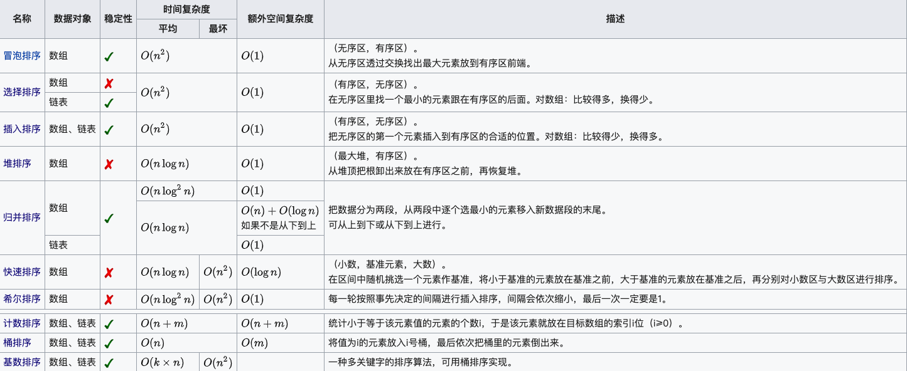

# algorithm

algorithm 算法

# 排序

* 冒泡排序
    1. 超出时间限制
* 插入排序：
    * 把待排序的记录按其关键码值的大小逐个插入到一个已经排好序的有序序列中

    1. 超出时间限制
* 希尔排序：
    * 是插入排序的一种更高效的改进版本。
      先选定一个整数gap，把待排序文件中所有记录分成gap个组，所有距离为gap的记录分在同一组内，并对每一组内的元素进行排序。
      然后将gap逐渐减小重复上述分组和排序的工作。
      当到达gap=1时，所有元素在统一组内排好序。

    1. 执行用时：13 ms, 在所有 Java 提交中击败了63.98%的用户
    2. 内存消耗：49.7 MB, 在所有 Java 提交中击败了95.83%的用户
* 快速排序：
    * 先从数列中取出一个数作为基准数进行排序

    1. 执行用时：7 ms, 在所有Java提交中击败了98.94%的用户
    2. 内存消耗：50.4 MB, 在所有Java提交中击败了60.36%的用户
* 选择排序
    * 首先在未排序序列中找到最小（大）元素，存放到排序序列的起始位置。
      再从剩余未排序元素中继续寻找最小（大）元素，然后放到已排序序列的末尾。

    1. 执行用时：2347 ms, 在所有Java提交中击败了5.02%的用户
    2. 内存消耗：50.4 MB, 在所有Java提交中击败了58.52%的用户
* 计数排序
    * 通过统计序列中各个元素出现的次数，完成对整个序列的升序或降序排序，
      这样的排序算法称为计数排序算法。

    1. 执行用时：2 ms, 在所有Java提交中击败了99.98%的用户
    2. 内存消耗：50.9 MB, 在所有Java提交中击败了39.21%的用户
* 桶排序
    * 桶排序是计数排序的扩展版本，计数排序可以看成每个桶只存储相同元素，
      而桶排序每个桶存储一定范围的元素，通过映射函数，
      将待排序数组中的元素映射到各个对应的桶中，对每个桶中的元素进行排序，
      最后将非空桶中的元素逐个放入原序列中。

    1. 执行用时：522 ms, 在所有Java提交中击败了33.65%的用户
    2. 内存消耗：51 MB, 在所有Java提交中击败了37.19%的用户
* 基数排序
    * 基数排序是一种非比较型整数排序算法，其原理是将整数按位数切割成不同的数字，然后按每个位数分别比较。
      由于整数也可以表达字符串（比如名字或日期）和特定格式的浮点数，所以基数排序也不是只能使用于整数。

    1. 执行用时：616 ms, 在所有Java提交中击败了33.60%的用户
    2. 内存消耗：50.9 MB, 在所有Java提交中击败了38.45%的用户
* 堆排序：
    * 每个结点的值都大于其左孩子和右孩子结点的值，称之为大根堆；
      每个结点的值都小于其左孩子和右孩子结点的值，称之为小根堆

    1. 执行用时：23 ms, 在所有Java提交中击败了36.82%的用户
    2. 内存消耗：50 MB, 在所有Java提交中击败了82.35%的用户
* 归并排序 - 递归
    * 分解（Divide）：将n个元素分成个含n/2个元素的子序列。
      解决（Conquer）：用合并排序法对两个子序列递归的排序。
      合并（Combine）：合并两个已排序的子序列已得到排序结果。

    1. 执行用时：14 ms, 在所有 Java 提交中击败了55.73%的用户
    2. 内存消耗：49.9 MB, 在所有 Java 提交中击败了87.76%的用户
* 归并排序 - 迭代器
    1. 执行用时：12 ms, 在所有 Java 提交中击败了68.11%的用户
    2. 内存消耗：49.9 MB, 在所有 Java 提交中击败了88.90%的用户

